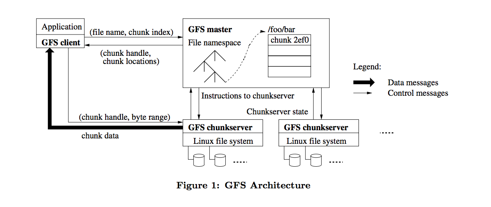
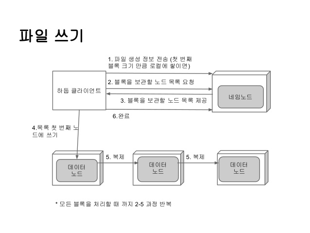
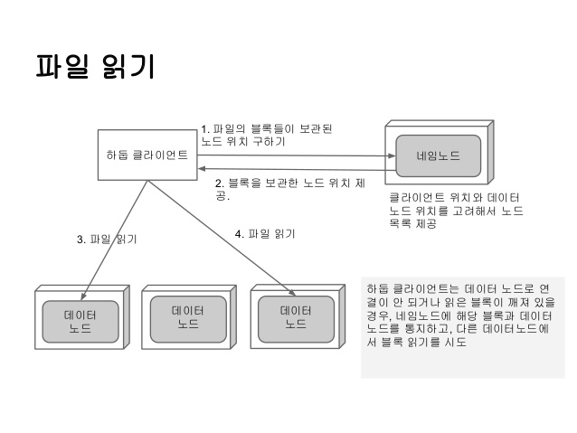
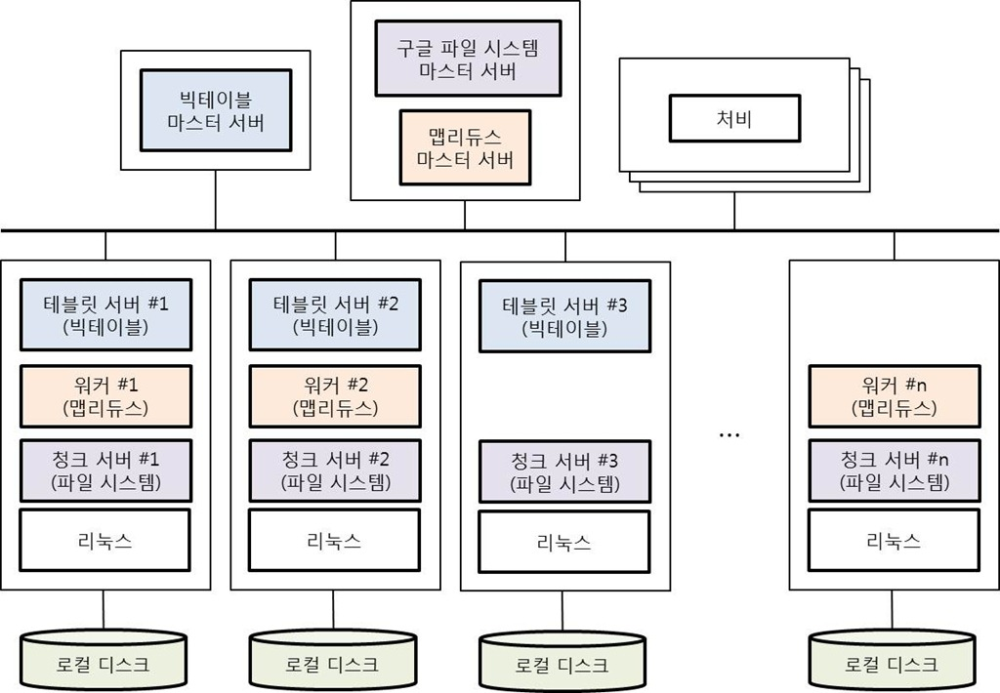
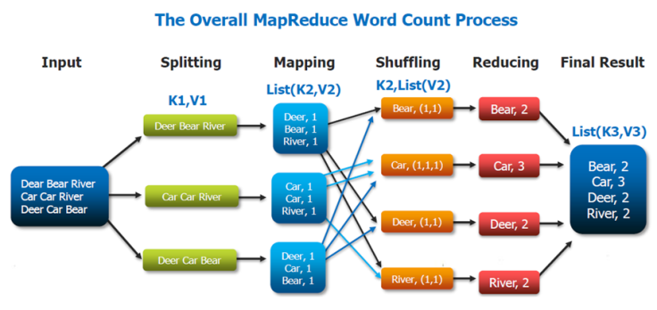
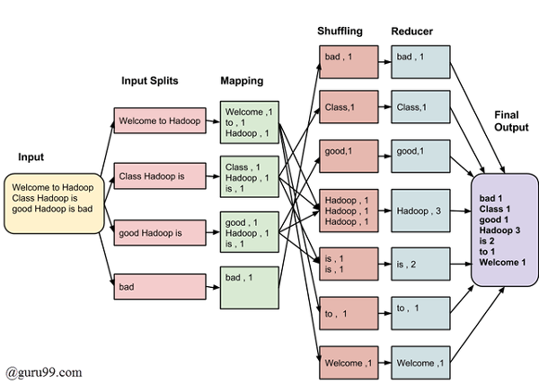
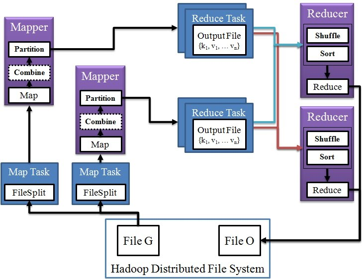
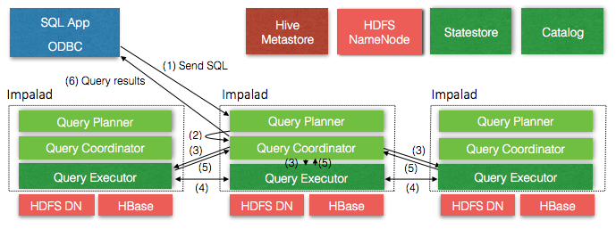

# 2장. 데이터 처리 기술
## 학습목표
    - 분산 파일 시스템, 공유 스토리지 등의 저장 기술의 종류와 기능을 이해한다
    - 분산 병렬 처리 기술에 대해 이해한다
    - 서버 가상화를 중심으로 한 클라우드 인프라 기술들을 이해한다

## 1절. 분산 데이터 저장 기술
### 1. 분산 파일 시스템
#### 가. 분산 파일 시스템의 개요
    - 분산 파일시스템, 클러스터, 데이터베이스, NoSQL로 구분
    - 파일의 메타데이터를 관리하는 전용 서버를 가지고 있는 비대칭형 클러스터 파일 시스템 개발
    - 메타데이터에 접근하는 경로와 데이터에 접근하는 경로가 분리된 구조
#### 나. 구글 파일 시스템(GFS, Google File System)
##### 1) 개념 및 특징
    - 파일을 고정된 크기의 청크로 나누고, 각 청크에 대한 여러 개의 복제본과 청크를 청크서버에 분산 저장한다
    - 트리 구조가 아닌 해시 테이블 구조 등을 사용해서 메모리상 효율적
    - 청크는 마스터에 의해 생성/삭제 가능, 유일한 식별자에 의해 구별
##### 2) GFS 설계의 가정
    - 서버의 고장이 빈번할 수 있다.
    - 대부분의 파일은 대용량
    - 작업의 부하는 주로 연속적으로 많은 데이터를 읽는 연산 또는 임의의 영역에서 적은 데이터를 읽는 연산에서 발생
    - 쓰기연산은 순차적, 파일에 대한 갱신은 드물게 이루어진다
    - 동기화 오버헤드를 최소화할 수 있는 방법 요구
    - 낮은 응답 지연시간보다 높은 처리율이 더 중요하다
##### 3) GFS의 구성요소
|||
|:--:|:--|
|클라이언트|- 파일에 대한 읽기/쓰기 동작을 요청하는 애플리케이션으로 POSIX(Portable Operating System Interface) 인터페이스를 지원하지 않으며, 파일 시스템 인터페이스와 유사한 자체 인터페이스를 지원 - 여러 클라이언트에서 원자적인 추가(atomic append)연산을 지원하기 위한 인터페이스를 지원|
|마스터|- 단일 마스터 구조로 파일 시스템의 이름 공간(name space), 파일과 chunk의 매핑 정보, 각 chunk가 저장된 청크서버들의 위치 정보 등에 해당하는 모든 메타 데이터를 메모리상에서 관리 - 주기적으로 수집되는 청크서버의 하트비트 메시지를 이용하여 chunk들의 상태에 따라 chunk를 재복제하거나 재분산하는 것과 같은 회복동작을 수행 - 하나의 chunk 서버를 primary로 지정하여 복제본의 갱신 연산을 일관되게 처리할 수 있도록 보장 - 마스터에 대한 장애 처리와 회복을 위해 파일시스템 이름 공간과 파일의 chunk 매핑 변경 연산을 로깅하고, 마스터의 상태를 여러 섀도 마스터에 복제|
|청크서버|- 로컬 디스크에 chunk를 저장, 관리하면서 클라이언트로부터의 chunk 입출력 요청을 처리 - 하트비트 메시지를 통해 청크서버의 상태에 대한 정보를 주기적으로 마스터에게 전달|

##### 4) GFS에서 파일을 읽어오는 과정

    - 클라이언트는 파일에 접근하기 위해 마스터로부터 해당 파일의 chunk가 저장된 chunk서버의 위치와 핸들을 먼저 받아온 뒤, 직접 청크서버에게 파일 데이터를 요청한다
#### 다. 하둡 분산 파일 시스템(HDFS, Hadoop Distributed File System)
##### 1) 개념 및 특징
    - HDFS는 GFS의 마스터와 유사한 하나의 네임노드(NameNode), GFS의 청크서버와 유사한 다수의 데이터노드(Datanode)로 구성
    - HDFS에서 파일 데이터는 블록단위로 나뉘어 여러 데이터노드에 분산,복제,저장
    - HDFS에서 기본적으로 파일은 한 번 쓰이면 변경되지 않는다고 가정(2.0 알파버전부터는 저장된 파일에 append가 가능)
    - HDFS는 순차적 스트리밍 방식으로 파일을 저장하거나 저장된 파일을 조회, 배치 작업에 적합하도록 설계
    - 낮은 데이터 접근 지연 시간보다는 높은 데이터 처리량에 중점
    - 클라이언트, 네임노드, 데이터노드 간의 통신을 위하여 TCP/IP 네트워크상에서 RPC를 사용
##### 2) HDFS의 구성요소
|||
|:--:|:--|
|네임노드|- 파일 시스템의 이름 공간 등 HDFS 상의 모든 메타데이터를 관리하며, 마스터/슬레이브 구조에서 마스터의 역할을 함 - 파일이 어떤 형태의 블록 단위로 나누어져 있고, 어떤 노드에 특정 블록이 있는지 등 시스템 전반의 상태를 모니터링  - 데이터를 저장하거나 애플리케이션을 실행하는 작업은 수행하지 않음 - 클라이언트로부터의 파일 접근 요청을 처리 - 데이터노드들로부터 하트비트를 받아 데이터노드들의 상태를 체크하는데, 하트비트 메시지에 포함된 블록정보를 가지고 블록의 상태를 체크할 수 있음|
|데이터노드|- HDFS의 슬레이브 노드로, 클라이언트로부터의 데이터 입출력 요청을 처리 - 데이터의 유실을 방지하기 위해 블록을 3중 복제하여 저장 - 블록을 저장할 때, 해당 블록에 대한 파일의 체크섬 정보를 별도로 저장  - 주기적으로 데이터노드의 상태를 나타내는 하트비트와 자신이 관리하는 블록의 목록인 blockreport를 네임노드에게 전송|
|보조네임노드|- HDFS 상태 모니터링을 보조 - 주기적으로 네임 노드의 파일 시스템 이미지를 스냅샷해 생성|
##### 3) HDFS의 파일 저장 과정

    - 클라이언트는 저장할 파일을 여러 단위블록으로 분리
    - 블록을 저장하기 위한 데이터노드 주소를 받은뒤, 첫 번째 데이터노드에게 데이터를 전송
    - 첫 번째 데이터 노드는 전송받은 데이터를 저장한 후, 두 번째 데이터노드로 전달
    - 두 번째 데이터 노드도 전달받은 데이터를 저장한 후, 세 번째 데이터노드로 전달
    - 세 번째 데이터 노드까지의 데이터 저장이 완료되면, 각 데이터노드들은 순차적으로 클라이언트에게 저장이 완료되었다는 신호를 보냄
    - 이러한 과정을 모든 블록의 저장이 완료될 때까지 반복한다
    - 모든 블록의 저장이 완료되면 네임노드는 블록들이 저장된 데이터노드의 주소, 즉 파일에 대한 메타 데이터를 저장
##### 4) HDFS의 파일 읽기 과정

    - 클라이언트는 읽고자 하는 파일에 대한 정보를 네임노드에게 요청
    - 네임노드는 파일에 대한 모든 블록의 목록과 블록이 저장된 데이터 노드의 위치를 클라이언트에게 반환
    - 클라이언트는 전달받은 블록의 위치를 이용해 데이터노드로부터 직접 데이터를 읽어 들인다

#### 라. 러스터(Lustre)
##### 1) 개념 및 특징
    - 객체 기반의 클러스터 파일 시스템
    - 클라이언트 파일 시스템, 메타데이터 서버, 객체 저장서버로 구성
    - 계층화된 모듈 구조 TCP/IP, 인피니밴드, 미리넷과 같은 네트워크 지원
##### 2) 구성요소
|||
|:--:|:--|
|클라이언트 파일 시스템|- 리눅스 VFS(Virtual File System)에서 설치할 수 있는 파일 시스템 - 메타데이터 서버와 객체 저장 서버들과 통신하면서 클라이언트 응용에 파일 시스템 인터페이스 제공|
|메타데이터 서버|- 파일 시스템의 이름 공간과 파일에 대한 메타데이터를 관리|
|객체 저장 서버|- 파일데이터를 저장하고, 클라이언트로부터의 객체 입출력 요청을 처리 - 데이터는 세그먼트라는 작은 데이터 단위로 분할해서 복수의 디스크 장치에 분산시키는 기술인 스트라이핑 방식으로 분산 저장|
##### 3) 구동방식
    - 러스터는 유닉스 시맨틱을 제공하면서 파일 메타데이터에 대해서는 라이트백 캐시를 지원
    - 클라이언트에서 메타데이터 변경에 대한 갱신 레코드를 생성하고 나중에 메타데이터 서버에 전달
    - 메타데이터 서버는 전달된 갱신 레코드를 재수행하여 변경된 메타데이터를 반영
    - 메타데이터 서버에서는 메타데이터를 동시에 접근하는 부하에 따라 클라이언트 캐시에서 라이트백 캐시를 지원하거나 메타데이터 서버에서 메타데이터를 처리하는 방식을 적용
    - 러스터는 메타데이터 서버에서 처리하도록 하는 방식을 사용해 메타데이터에 대한 동시 접근이 적으면 클라이언트 캐시를 이용한 라이트백 캐시를 사용하고, 메타데이터에 대한 동시접근이 많으면 클라이언트 캐시를 사용함으로써 발생할 수 있는 오버헤드를 줄인다.
    - 러스터는 파일의 메타데이터와 파일 데이터에 대한 동시성 제어를 위해 별도의 잠금을 사용한다.
    - 메타데이터에 접근하기 위해서는 메타데이터 서버의 잠금 서버로부터 잠금을 획득해야 한다.
    - 파일 데이터에 접근하기 위해서는 해당 데이터가 저장된 객체 저장 서버의 잠금 서버로부터 잠금을 획득해야 한다
    - 러스터는 클라이언트와 메타데이터 서버 간의 네트워크 트래픽을 최소화하기 위하여 메타데이터에 대한 잠금 요청 시에 메타데이터 접근 의도를 같이 전달하는 인텐트 기반 잠금 프로토콜을 사용한다
    - 메타데이터 서버는 메타데이터 접근 의도에 따라 해당 동작을 수행하고, 잠금을 승인하는 처리를 함꼐 수행함으로써 클라이언트와 메타데이터 서버간의 네트워크 트래픽을 줄일 수 있다. 
#### 마. 파일 시스템 비교
|구분|GFS|하둡 DFS|러스터|
|:--:|:--:|:--:|:--:|
|Open Source|O|O|O|
|Chunk Based|O|O|X|
|Support Replication|O|O|X|
|Multiple metadata server supported|X|X|X|
|Locks used to maintain atomicity|O|O|O|
|Uses a DB for storing metadata|X|X|X|
|Adding nodes without shutting down the system|O|O|O|
|POSIX support|X|X|O|
|Supports file modification|X|X|O|

### 2. 데이터베이스 클러스터
#### 가. 개념
    - 하나의 데이터베이스를 여러 개의 서버상에 구축하는 것을 의미
    - 데이터베이스 파티셔닝은 데이터베이스를 여러 부분으로 분할하는 것
    - 분할된 각 요소는 파티션
    - 각 파티션은 여러 노드로 분할 배치되어 여러 사용자가 각 노드에서 트랜잭션을 수행
    - 데이터를 통합할 때, 성능과 가용성의 향상을 위해 데이터베이스 차원의 파티셔닝 또는 클러스터링을 이용
#### 나. 데이터베이스 파티셔닝 구현의 효과
|||
|:--:|:--|
|병렬처리|파티션 사이의 병렬 처리를 통한 빠른 데이터 검색 및 처리 성능을 얻을 수 있다|
|고가용성|특정 파티션에서 장애가 발생하더라도 서비스가 중단되지 않는다|
|성능향상|성능의 선형적인 증가 효과를 볼 수 있다|
#### 다. 데이터베이스 클러스터의 구분
##### 1) 무공유 디스크
    - 무공유 클러스터에서 각 데이터베이스 인스턴스는 자신이 관리하는 데이터 파일을 자신의 로컬 디스크에 저장하며, 이 파일들은 노드 간에 공유하지 않는다
    - 각 인스턴스나 노드는 완전히 분리된 데이터의 서브 집합에 대한 소유권을 가지고 있으며, 각 데이터는 소유권을 갖고 있는 인스턴스가 처리
    - 한 노드가 데이터 처리 요청을 받으면, 해당 노드는 처리할 데이터를 갖고 있는 노드에 신호를 보내 데이터 처리를 요청
    - Oracle RAC(Real Application Cluster)를 제외한 대부분의 데이터베이스 클러스터가 무공유 방식을 채택
|||
|:--:|:--|
|장점|노드 확장에 제한이 없다|
|단점|각 노드에 장애가 발생할 경우를 대비해 별도의 폴트톨러런스를 구성해야 한다|

##### 2) 공유 디스크
    - 공유 디스크 클러스터에서 데이터 파일은 논리적으로 모든 데이터베이스 인스턴스 노드들은 데이터 파일을 논리적으로 공유하며, 각 인스턴스는 모든 데이터에 접근할 수 있다.
    - 데이터를 공유하려면 SAN(Storage Area Network)과 같은 네트워크가 반드시 있어야 한다
    - 모든 노드가 데이터를 수정할 수 있기 때문에 노드간의 동기화 작업 수행을 위한 별도의 커뮤니케이션 채널이 필요하다
|||
|:--:|:--|
|장점|높은 수준의 폴트톨러런스를 제공하므로 클러스터를 구성하는 노드 중 하나의 노드만 살아 있어도 서비스가 가능하다 |
|단점|클러스터가 커지면 디스크 영역에서 병목현상이 발생|
#### 라. 데이터베이스 클러스터의 종류
##### 1) Oracle RAC 데이터베이스 서버
    - 공유 클러스터
    - 클러스터의 모든 노드에서 실행되며 데이터는 공유 스토리지에 저장
    - 특정 노드가 데이터를 소유하는 개념이 없다
    - 파티셔닝 필요 없다. 하지만, 성능향상을 위해 파티셔닝하는 경우 빈번
    - 응용 프로그램은 클러스터의 특정 노드가 아니라 RAC 클러스터에 연결
    - RAC는 클러스터의 모든 노드에 로드를 고르게 분산
<Oracle RAC 데이터베이스 서버의 장점>
|||
|:--:|:--|
|가용성|높은 수준의 폴트톨러런스를 제공하므로 클러스터를 구성하는 노드 중 하나의 노드만 살아 있어도 서비스가 가능하다|
|확장성|새 노드를 클러스터에 쉽게 추가할 수 있다.|
|비용 절감|예를들어 4CPU 16노드 클러스터를 사용하면 동급 성능의 64CPU SMP 시스템에 비해 비용을 크게 절감할 수 있다|

##### 2) IBM DB2 ICE(Integrated Cluster Environment)
    - CPU, 메모리, 디스크를 파티션별로 독립적으로 운영하는 무공유 방식의 클러스터링을 지원
    - 애플리케이션은 여러 파티션에 분산된 데이터베이스를 하나의 데이터베이스로 보게 되고, 데이터가 어느 파티션에 존재하고 있는지 알 필요가 없다.
    - 데이터와 사용자가 증가하면 애플리케이션의 수정없이 기존 시스템에 노드를 추가하고 데이터를 재분배함으로써 시스템의 성능과 용량을 일정하게 유지할 수 있다.
    - 각 노드로 분산되는 파티셔닝을 어떻게 구성하느냐에 따라 성능의 차이가 많이 발생할 수 있다.
    - 하나의 노드에 장애가 발생할 경우, 해당 노드에서 서비스하는 데이터에 대한 별도의 failover 메커니즘이 필요
    - DB2를 이용하여 클러스터링을 구성할 떄는 공유디스크 방식을 사용하여 가용성 보장
##### 3) 마이크로소프트 SQL Server
    - SQL Server는 연합 데이터베이스 형태로 여러 노드로 확장할 수 있는 기능을 제공
    - 연합 데이터베이스는 디스크 등을 공유하지 않는 독립된 서버에서 실행되는 서로 다른 데이터베이스들 간의 논리적인 결합이며, 네트워크를 이용하여 연결된다
    - 데이터는 관련된 서버들로 수평 분할되며, 테이블을 논리적으로 분리해 물리적으로는 분산된 각 노드에 생성한다
    - 각 노드의 데이터베이스 인스턴스 사이에 링크를 구성한 후 모든 파티션에 대해 UNION ALL을 이용해 논리적인 뷰를 구성하는 방식
    - 분산된 환경의 데이터에 대한 싱글 뷰를 제공
    - SQL Server에서는 이런 뷰를 DPV(Distributed Partitioned View)라고 한다
    - 마이크로소프트 SQL Server 구성의 문제점
        - DBA나 개발자가 파티셔닝 정책에 맞게 테이블과 뷰를 생성해야한다
        - 전역 스키마 정보가 없기 때문에 질의 수행을 위해 모든 노드를 액세스 해야 한다
        - 노드가 많아지거나 노드의 추가/삭제가 발생하는 경우 파티션을 새로 구성해야 한다. 또한 페일오버에 대해서는 별도로 구성해야 한다
    - SQL Server에서도 페일오버 메커니즘을 제공하지만, Active-Active가 아닌 Active-Standby 방법을 사용하고 있다
##### 4) MySQL
###### 가) 개념 및 특징
    - MySQL 클러스터는 비공유항으로서 메모리 기반 데이터베이스의 클러스터링을 지원
    - 병렬 서버구조로 확장이 가능
    - 관리노드, 데이터노드, MySQL 노드로 구성
|||
|:--:|:--|
|관리노드|클러스터를 관리하는 노드로 클러스터 시작과 재구성 시에만 관여|
|데이터노드|클러스터의 데이터를 저장하는 노드|
|MySQL|클러스터 데이터에 접근을 지원하는 노드|
    - 데이터의 가용성을 높이기 위해 데이터를 다른 노드에 복제시키며, 특정 노드에 장애가 발생하더라도 지속적인 데이터 서비스가 가능하다
    - 장애가 발생했던 노드가 복구되어 클러스터에 투입된 경우에도 기존 데이터와 변경돈 데이터에 대한 동기화 작업이 자동으로 수행
    - 데이터는 동기화 방식으로 복제되며, 이런 작업을 위해 일반적으로 데이터 노드 간에는 별도의 네트워크를 구성
    - MySQL의 최근 버전에서는 디스크 기반의 클러스터링을 제공한다.
    - 디스크 기반 클러스터링에서는 인덱스가 생성된 칼럼은 기존과 동일하게 메모리에 유지되지만, 인덱스를 생성하지 않은 칼럼은 디스크에 저장된다
###### 나) MySQL 클러스터 구성을 할 경우의 제한 사항
    - 파티셔닝은 LINEAR KEY 파티셔닝만 가능
    - 클러스터에 참여하는 노드(SQL 노드, 데이터노드, 매니저를 포함) 수는 255로 제한
    - 데이터 노드는 최대 48개까지만 가능
    - 트랜잭션 수행 중에 롤백을 지원하지 않으므로 작업 수행 중에 문제가 발생하였다면, 전체 트랜잭션 이전으로 롤백해야 한다
    - 하나의 트랜잭션에 많은 데이터를 처리하는 경우 메모리 부족 문제가 발생할 수 있으며 여러 개의 트랜잭션으로 분리해 처리하는 것이 좋다
    - 칼럼명의 길이는 31자, 데이터베이스의 테이블명 길이는 122자까지로 제한된다. 데이터 베이스 테이블, 시스템 테이블, 블롭 인덱스를 포함한 메타데이터는 2만 320개까지만 가능
    - 클러스터에서 생성할 수 있는 테이블 수는 최대 2만 320개
    - 한 로우의 크기는 8KB
    - 데이블의 키는 32개가 최대
    - 모든 클러스터의 기종은 동일해야 한다
    - 운영 중에 노드를 추가/삭제할 수 없다.
    - 디스크 기반 클러스터인 경우 tablespace의 개수는 2^32, tablespace당 데이터 파일의 개수는 2^16 데이터 파일의 크기는 32GB까지 가능

### 3. NoSQL
#### 가. NoSQL의 개념 및 특징
    - 분산 데이터베이스 기술
    - 비관계형 데이터베이스 관리 시스템, SQL 계열 쿼리 언어 사용 가능
    - Not Only SQL이라고도 함
    - Key-value 모델, Document 모델(Jason 혹은 XML 데이터), Graph 모델, Column 모델
    - NoSQL은 key와 value의 형태로 자료를 저장하고, 빠르게 조회할 수 있는 자료 구조를 제공하는 데이터 저장소이다
    - 스키마 없이 동작하며, 구조에 대한 정의 변경 없이 자유롭게 데이터베이스의 레코드에 필드를 추가할 수 있따
    - 전통적인 RDBMS의 장점이라고 할 수 있는 복잡한 Join 연산 기능은 지원하지 않지만 대용량 데이터 처리와 대규모의 수평적 확장성을 제공한다
    - NoSQL은 대부분이 오픈소소
    - 구글 빅테이블, 아파치 HBase, 아마존 SimpleDB, 마이크로소프트 SSDS 등이 있다
#### 나. 구글 빅테이블
##### 1) 개념 및 특징    
    - 공유 디스크 방식
    - 모든 노드가 데이터, 인덱스 파일을 공유
    - 실시간 서비스뿐만 아니라 주기적인 배치 작업과 대용량 데이터의 분석 처리에도 적합하도록 구성
    - 빅테이블과 유사한 솔루션으로는 아파치 오픈소스 프로젝트인 HBase와 NHN가 개발한 Neptune이 있다
##### 2) 데이터 모델
    - 빅테이블은 multi-dimension sorted hash map을 파티션하여 분산 저장하는 저장소다.
    - 테이블 내의 모든 데이터는 row-key의 사전적 순서로 정렬, 저장
    - 테이블의 파티션은 row-key를 이용하여 이루어지고, Tablet이라고 불리는 분리된 파티션은 분산된 노드에서 서비스된다. 한 Tablet의 크기는 보통 100~200MB
    - row는 n개의 column-family를 가질 수 있으며 column-family에는 column-key, value, time stamp의 형태로 데이터를 저장한다.
    - 하나의 row-key, column-family내에 저장되는 데이터는 column-key의 사전적 순서로 정렬되어 있다.
    - 동일한 column-key에 대해 타임스탬프가 다른 여러 버전의 값이 존재할 수 있으며, 타임스탬프는 칼럼 값의 버전을 관리하기 위해 사용된다
    - BigTable에 저장되는 하나의 데이터의 키 값 또는 정렬 기준은 'rowkey + column-key + timestamp'이다
##### 3) 페일오버
    - 특정 노드에 장애가 발생할 경우, 빅테이블의 마스터는 장애가 발생한 노드에서 서비스되던 Tablet을 다른 노드로 재할당시킨다.
    - 재할당 받은 노드는 구글 파일 시스템에 저장도니 변경 로그 파일, 인덱스 파일, 데이터 파일 등을 이용해 데이터 서비스를 위한 초기화 작업을 수행한 후 다시 데이터 서비스를 한다
    - 빅테이블의 SPOF(Single Point Of Failure, 시스템의 구성 요소 중 동작하지 않으면 전체 시스템이 중단되는 요소)는 마스터
    - 분산 락 서비스를 제공하는 Chubby를 이용해 Master를 계속 모니터링 하다가 마스터에 장애가 발생하면 가용한 노드가 마스터 역할을 수행하도록 한다
    - Chubby는 폴트톨러런스 지원 구조이기 때문에 절대로 장애가 발생하지 않는다

##### 4) AppEngine
    - AppEngine은 구글 클라우드 플랫폼의 일부로 빅테이블을 사용한다
    - 사용자에게 직접 빅테이블의 API를 공개하지 않고 추상 계층을 두고 있는데, API뿐만 아니라 데이터 모델도 추상화되어 있다
    - 사용자 테이블을 생성할 경우, 빅테이블의 테이블로 생성되는 것이 아니라 빅테이블의 특정 테이블에 대한 한 영역만을 차지하게 된다
    - 빅테이블에서는 별도의 사용자 정의 인덱스를 제공하지 않는 반면, AppEngine에서는 사용자가 수행하는 쿼리를 분석하여 자동으로 인덱스를 생성해 준다
    - AppEngine에서 생성한 인덱스도 빅테이블의 특정 테이블 또는 테이블 내의 컬럼으로 저장된다
#### 다. Hbase
    - 하둡 분산 파일 시스템을 기반으로 구현된 컬럼 기반의 분산 데이터베이스
    - HBase는 관계형 구조가 아니며, SQL을 지원하지 않는다
    - 구조화된 데이터보다는 비구조화된 데이터에 더 적합
    - 선형 확장이 가능
    - 수평적으로 확장성이 있어 큰 테이블에 적합하며, 단일행의 트랜잭션을 보장한다
    - 로우키에 대한 인덱싱만을 지원, Zookeeper를 이용한 고가용성 보장
    
#### 라. 아마존 SimpleDB
    - SimpleDB는 아마존의 데이터 서비스 플랫폼으로, 웹 애플리케이션에서 사용하는 데이터의 실시간 처리를 지원한다
    - SimpleDB는 주로 아마존의 다른 플랫폼 서비스와 같이 사용
    - EC2, S3등과 같은 아마존의 내부 서비스 간 네트워크 트래픽 무료, 외부와의 In/Out 트래픽에는 요금 부과
    - 사용자는 EC2에서 수행되는 웹 서버로 접근하고, 웹 서버에서 SimpleDB의 데이터를 조회해 적절하게 가공한 후 사용자에게 제공하는 형태로 구성
    - 비용을 염두에 두지 않은 경우라면 외부에서 직접 SimpleDB에 접근해 사용하는 것도 가능
    - SimpleDB는 하나의 데이터에 대해 여러 개의 복제본을 유지하는 방식으로 가용성을 높이며, 트랜잭션 종료 후 데이터가 모든 노드에 즉시 반영도지 않고 초 단위로 지연 동기화되는 'Eventual Consistency' 정책을 취한다
    - 관계형 데이터 모델과 표준 SQL을 지원하지 않으며, 전용 쿼리 언어를 이용
    - SimpleDB의 데이터 모델은 'Domain, Item, Attribute, Value로 구성되며 스키마가 없는 구조이다
|||
|:--:|:--|
|도메인|- 관계형 데이터베이스의 테이블과 동일한 개념 - 도메인에는 최대 10GB의 데이터를 저장할 수 있으며, 사용자는 100개의 도메인을 가질 수 있음 - 사용자는 최대 1,000GB의 데이터를 SimpleDB에 저장 가능|
|Item|- 관계형 데이터베이스의 레코드와 동일한 개념 - item은 독립적인 객체를 나타내며, 1개 이상 256개 이하의 Attribute를 가짐|
|Attribute|- 관계형 데이터베이스의 칼럼과 동일한 개념이지만 사용하기 전에 미리 정의할 필요가 없음 - Name, Value 쌍으로 데이터를 저장하고 저장되는 데이터의 Name은 attribute의 이름에 해당 - item의 특정 Attribute(Cell)에는 여러 개의 값을 저장할 수 있음|
    - 여러 도메인에 걸친 쿼리는 허용되지 않는다.
    - 1:N관계의 데이터 모델을 갖는 두 개의 도메인으로부터 데이터를 조회할 경우 쿼리가 여러 번 수행돼야 하는 단점이 있다
|구분|내용|
|:--:|:--|
|CreateDomain|도메인을 생성|
|DeleteDomain|도메인을 삭제|
|ListDomains|모든 도메인의 목록을 가져옴|
|PutAttributes|Item을 생성하고 Attribute에 값을 추가|
|DeleteAttributes|Attribute 값을 삭제|
|GetAttributes|Attribute의 값을 조회|
|Query|-쿼리를 이용하여 조건에 맞는 여러개의 item을 조회 - 한 번의 쿼리는 최대 5초 이내에 수행되어야하며, 쿼리 결과로 받을 수 있는 item 수는 256개|
#### 마. 마이크로소프트 SSDS
    - SSDS(SQL Server Data Service)의 데이터 모델은 컨테이너, 엔티티로 구성
|||
|:--:|:--|
|컨테이너|테이블과 유사한 개념이지만 하나의 컨테이너에 여러 종류의 엔티티를 저장할 수 있다|
|엔티티|엔티티는 레코드와 유사한 개념으로 하나의 엔티티는 여러 개의 property를 가질 수 있으며, property는 name-value 쌍으로 저장|
    - 관계형 데이터베이스에서는 엔티티를 구분하고 엔티티별로 테이블을 생성하는 것이 일반적이다. 하지만 SSDS를 이용하여 애플리케이션을 개발하면 관련된 정보를 하나의 컨테이너에 저장한다
    - SSDS는 컨테이너의 생성/삭제, 엔티티의 생성/삭제, 조회, 쿼리 등의 API를 제공하고 SOAP/REST 기반의 프로토콜을 지원

## 2절. 분산 컴퓨팅 기술
### 학습목표
    - MapReduce의 개념, 특징, 실행과정을 이해한다
    - 병렬 쿼리 시스템의 다양한 종류와 그 특징들을 이해한다
    - SQL on Hadoop 기술과 종류를 이해한다
### 1. MapReduce
#### 가. MapReduce의 개념 및 특징
    - 분산 병렬 컴퓨팅 프레임워크
    - 분할정복 방식으로 대용량 데이터를 병렬로 처리

    - 맵리듀스에서 Client의 수행 작업 단위는 맵리듀스 잡이라고 하며, 잡은 Map Task와 Reduce Task로 나뉘어서 실행된다
    - Map Task 하나가 1개의 블록을 대상으로 연산
#### 나. 구글 MapReduce
##### 1) 구글 MapReduce의 개발 배경
    - 연산의 병렬화, 장애 복구 등의 복잡성을 추상화시켜서 개발자들이 오직 핵심 기능 구현에만 집중할 수 있도록 하기 위해서 개발
##### 2) 프로그래밍 모델: Map과 Reduce라는 2개의 단계로 나눌 수 있음

    - Map에서는 key와 value의 쌍들을 입력으로 받는다
    - 하나의 key, value쌍은 사용자가 정의한 Map 함수를 거치면서 다수의 새로운 key, value쌍들로 변환되어 로컬 파일 시스템에 저장
    - 저장된 임시 파일들은 프레임워크에 의해 Reduce에게 전송된다. 이 과정에서 자동으로 Shuffling과 Group by 정렬의 과정을 거친 후 Reduce의 입력 레코드로 들어가게 되는데 형식은 key와 value의 리스트다
    - Reduce의 입력 레코드들은 사용자가 정의한 Reduce 함수를 통해 최종 Output으로 산출된다
    - 사용자 관점에서는 이전에 언급했던 장애 복구와 같은 세세한 이슈들은 신경 쓸 필요없이 Map과 Reduce 두 함수만 작성하는 것만으로 대규모 병렬 연산 작업을 수행 할 수 있다.
##### 3) 실행 과정
    - 사용자가 MapReduce 프로그램을 작성해 실행한다
    - 마스터는 사용자의 프로그램에서 지정한 입력 데이터소스를 가지고 스케쥴링을 한다
    - 하나의 큰 파일은 여러 개의 파일 split들로 나뉘며, 각 split들이 Map 프로세스들의 할당 단위가 된다. split수만큼 Map Task들이 워커로부터 fork됨과 동시에 실행돼 Output을 로컬 파일 시스템에 저장 한다
    - 이 때, Output 값들은 partitioner라는 Reduce 번호를 할당해 주는 클래스를 통해 어떤 Reduce에게 보내질지 정해진다. 특별히 정해지지 않으면 Key와 해시값을 Reduce의 개수로 Modular 계산한 값이 부여되어 동일한 Key들은 같은 Reduce로 배정된다
    - Map 단계가 끝나면 원격의 Reduce 워커들이 자기에 할당된 Map의 중간 값들을 네트워크로 가져, 사용자의 Reduce 로직을 실행해 최종 산출물을 얻어낸다.
    - 보통 Reduce의 개수는 Map의 개수보다 적으며, 실행 흐름에서 알 수 있듯이 Map의 중간 데이터 사이즈에 따라 성능이 좌우된다
    - MapReduce 모델 적용의 적합성
<MapReduce 모델 적용의 적합성>
|적합한 경우|적합하지 않은 경우|
|:--:|:--:|
|분산 Grep이나 빈도 수 계산 등의 작업 -> Map 단계를 거치면서 데이터 사이즈가 크게 줄어들고, 줄어든 크기만큼 Reduce 오버헤드도 줄어듦에 따라 성능상 이점이 많다. |정렬과 같은 작업 -> 입력 데이터의 사이즈가 줄지않고, 그대로 Reduce로 전해지므로 오버헤드에 따라 수행 성능이 저하된다.|
##### 4) 폴트톨러런스
    - 각 프로세스에서는 Master에게 Task 진행 상태를 주기적으로 보낸다.
    - 마스터는 모든 워커들의 Task 상태 정보를 가지고 있다가 특정 워커의 태스크가 더 이상 진행되지 않거나 상태 정보를 일정한 시간 동안 받지 못하면 Task에 문제가 있다고 결론을 내린다
    - 이후 장애 복구를 해야 하는데 특정 Map이나 Reduce Task들이 죽은 경우, 해당 Task가 처리해야할 데이터 정보만 다른 워커에게 전해 주면 워커는 받은 데이터 정보를 인자로 새로운 Task를 재실행하면 된다
    - 이처럼 MapReduce는 Shared Nothing 아키텍처이기 떄문에 간단한 메커니즘을 가진다
#### 다. Hadoop MapReduce
##### 1) Haddop MapReduce의 개발 배경
##### 2) 아키텍처
    - 하둡은 데몬(서버의 메인메모리 상에서 백그라운드로 수행되는 프로그램)관점에서 4개의 구성요소를 가지고 있다.
|구분|설명|
|:--:|:--|
|네임노드|하둡을 이루는 가장 기본적이고 필수적인 데몬으로, 네임 스페이스를 관리하는 마스터 역할을 수행|
|데이터노드|분산 파일 시스템의 데몬으로 파일의 실질적인 데이터 입출력에 대한 처리를 수행|
|잡트래커|MapReduce 시스템에서 job이라는 작업을 관리하는 마스터에 해당(클러스터에 1개의 잡트래커가 존재)|
|태스크트래커|작업을 수행하는 워커 데몬이며 슬레이브에 해당(각 노드에 1개의 태스크 트래커가 존재|
    - 클라이언트에서 잡이라고 불리는 하둡 작업을 실행하면, 프로그램 바이너리와 입출력 디렉터리와 같은 환경 정보들이 JobTracker에게 전송된다
    - JobTracker는 작업을 다수의 Task로 쪼갠 후, 데이터 지역성을 보장하기 위해 그 Task들을 어떤 TaskTracker에게 보낼지를 감안해 내부적으로 스케줄링해 큐(Queue)에 저장한다
    - 이 때, Task는 맵퍼나 리듀서가 수행하는 작업 단위를 의미한다
    - TaskTracker는 JobTracker에게 3초에 한 번씩 주기적으로 하트비트를 보내 살아 있다는 것을 알린다.
    - TaskTracker에서 Heartbeat를 보내면 JobTracker는 먼저 해당 TaskTracker에게 할당된 Task가 있는지 큐에서 살펴본 후, Task가 있으면 하트비트의 Response 메시지에 Task 정보를 실어서 TaskTracker에게 보낸다.
    - TaskTracker는 Response 메시지의 내용을 분석해 프로세스를 fork해 자기에게 할당된 Task를 처리한다
##### 3) Hadoop MapReduce의 실행절차

    
    - MapReduce는 아래와 같은 단계들을 거쳐 실행된다.
        - 1. 스플릿 : HDFS의 대용량 입력 파일을 분리하여 파일스플릿을 생성하고, FileSplit 하나당 맵 태스크 하나씩을 생성
        - 2. 맵 : 각 Split에 대해서 레코드 단위로 map함수를 적용하여 key-value 쌍을 생성한다
        - 3. 컴바인 : 리듀스와 동일한 프로그램을 적용하여, 리듀스단계로 데이터를 보내기 전에 중간 결과값들을 처리하여 데이터의 크기를 줄여준다
        - 4. 파티션 : key를 기준으로 데이터를 디스크에 분할 저장하며, 각 파티션은 키를 기준으로 정렬이 수행된다. 또한 분할된 파일들은 각각 다른 리듀스 태스크에 저장된다. 
        - 5. 셔플 : 여러 맵퍼들의 결과 파일을 각 리듀서에 할당하고, 할당된 파일을 로컬 파일 시스템으로 복사한다.
        - 6. 정렬 : 병합 정렬방식을 이용하여 맵퍼의 결과파일을 key를 기준으로 정렬
        - 7. 리듀스 : 정렬 단계에서 생성된 파일에 대해 리듀스 함수를 적용한다
    - Hadoop Mapreduce 연산에서 기본적으로 Output format은 key와 value를 탭으로 구분하며, mapred.textoutputformat.separator 속성을 사용하여 구분자를 원하는 문자로 변경할 수도 있다.
    - 맵리듀스 작업의 대표적인 예제인 WordCount의 수행과정은 다음 도표와 같다.

##### 4) 하둡의 성능

    - MapReuce의 sort는 MapReduce에서 어떠한 작업을 실행하더라도 Map에서 Reduce로 넘어가는 과정에서 항상 발생하는 내부적인 프로세스이다
    - sort 작업은 데이터가 커질수록 처리 시간이 선형적으로 증가한다
    - 클러스터 구성 서버들의 숫자를 늘림으로써 처리 시간을 줄일 수 있는 것은 아니며, 플랫폼 자체적으로 선형 확작성을 갖고 있어야 처리 시간을 줄일 수 있다.
    - 이런 의미에서 sort는 하둡 같은 분산컴퓨팅 플랫폼의 성능과 확장성을 동시에 측정할 수 있는 좋은 실험이라고 할 수 있다. 

##### 5) 하둡 사용 현황

|구분|사용현황|
|:--:|:--|
|야후|- 활발하게 하둡을 사용하고 있는 하둡 프로젝트의 주요 후원자 - 4만대 이상의 컴퓨터에서 하둡을 설치해 사용하고 있고, 가장 큰 클러스터는 약 4,500개의 노드로 구성|
|야후의 WebMap|- 야후의 대표적인 그래프 기반 검색 엔진 - 알려진 웹 페이지들의 모든 edge 및 링크 정보를 계산해 그 결과를 다양한 검색 애플리케이션에서 사용할 수 있도록 해주는 거대한 그래프 - 주기적으로 100개 이상의 MapReduce 작업들을 체인 형태로 묶어 실행시키는데, 출력결과만 압축해서 300TB 이상이 나올 정도로 대용량 데이터를 다루고 있음|
|국내|- NHN과 다음 등의 인터넷 포털에서 하둡을 사용 중 - 삼성 SDS, SK 등의 IT회사에서 대용량 데이터 분석 등의 목적으로 하둡을 활용 중|

### 2. 병렬 쿼리 시스템
#### 가. 병렬 쿼리 시스템의 개요
    - 구글이나 하둡의 MapReduce는 개발자들에게 구현하려는 알고리즘에만 포커싱 할 수 있도록 간단한 프로그래밍 모델을 제공하였으나, 일부 사용자들에게는 새로운 개념이기 떄문에 여전히 쉽지 않다.
    - 쿼리 인터페이스를 통해 병렬 처리를 할 수 있는 시스템들이 개발 됐다.
    - 구길의 Sawzall, 야후의 Pig 등이 있으며, 사용자가 MapReduce를 쉽게 사용할 수 있도록 새로운 쿼리 언어로 추상화된 시스템들이다
#### 나. 구글 Sawzall
    - 구글 Sawzall는 MapReduce를 추상화한 최초의 스크립트 형태 병렬 쿼리 언어다.
    - Pig, Hive도 Sawzall과 유사하다
#### 다. 아파치 Pig
##### 1) 정의 및 특징
    - 아파치 Pig는 야후에서 개발
##### 2) 개발 배경
    - 실제 대부분의 업무는 한번의 MapReduce 작업으로 끝나지 않는 경우가 많다.
##### 3) 사용 예제
    - MapReduce는 무공유 구조이기 떄문에 일반 RDB로는 쉽게 해결할 수 있는 join 연산을 매우 복잡하게 처리하므로 위 문제를 해결하기 위해 개발자는 약 400라인에 가까운 코드를 프로그래밍 해야 한다.
    - 하지만 Pig를 이용하면 단 10라인의 코드로 간단히 해결이 가능
##### 4) 사용 현황
#### 라. 아파치 하이브
##### 1) 정의 및 특징
    - 하이브는 페이스북에서 개발한 데이터 웨어하우징 인프라로 아파치 내의 하둡 서브 프로젝트로 등록돼 개발되고 있다.
    - SQL 기반의 쿼리 언어와 JDBC를 지원한다
    - Hadoop-Streaming을 쿼리 내부에 삽입해 사용할 수 있다.
    - 아파치 하이브는 맵리듀스의 모든 기능을 지원한다
##### 2) 개발배경
##### 3) 하이브 아키텍처
    - 하이브의 구성요소 중에서 MetaStore는 Raw File들의 콘텐츠를 일종의 테이블 내 칼럼처럼 구조화된 형태로 관리할 수 있게 해주는 스키마 저장소
    - 별도의 DBMS를 설정하지 않으면 Embedded Derby를 기본 데이터베이스로 사용
    - 앞 단에는 커맨드 라인 인터페이스가 있는데 사용자가는 이 CLI를 통해 Join이나 Group by 같은 SQL 쿼리를 사용
    - 그러면 파서에서 쿼리를 받아 구문 분석을 하고, MetaStore에서 테이블과 파티션 정보를 참조해 Execution Plan을 만든다
    - Execution Engine은 하둡의 JobTracker와 네임노드와 통신을 담당하는 창구 역할을 하면서 MapReduce 작업을 실행하고 파일을 관리한다
    - 아래 그림 오른쪾 하단의 SerDe라는 것은 Serializer와 Deserializer의 줄임말이며, 테이블의 로우나 칼럼의 구분자 등 저장 포맷을 정의해주는 컴포넌트다. 하둡의 InputForamt과 OutputFormat에 해당한다고 볼 수 있다.
##### 4) 하이브의 언어 모델

|DDL(Data Definition Language|DML(Data Manipulation Language|Query|
|:--|:--|:--|
|- 테이블 생성(Create table), 삭제(Drop Table), 변경(Rename Table) 명령 - 테이블 스키마 변경(Alter Table, Add Column) - 테이블 조회(Show Table), 스키마 조회(Describe Table)|- 로컬에서 DFS로 데이터 로드(LOAD DATA) - 쿼리 결과를 테이블이나 로컬 파일시스템, DFS 저장|- Select, Group by, Sort by, Joins, Union, Sub Queries, Sampling, Transform|

### 3. SQL on 하둡
#### 가. SQL on 하둡 개요
    - 실시간 제약사항을 극복하기 위한 시도 중 하나
    - 실시간 SQL 질의 분석 깃ㄹ
    - 임팔라에 대해 학습
#### 나. 임팔라의 개념 및 특징
    - SQL on 하둡 기술 중 먼저 대중에게 공개된 기술
    - 임팔라는 분석과 트랜잭션 처리를 모두 지원하는 것을 목표로 만들어진 SQL 질의 엔진
    - 하둡과 Hbase에 저장된 데이터를 대상으로 SQL 질의를 할 수 있다.
    - 고성능을 낼 수 있도록 C++언어를 사용, 맵리듀스를 사용하지 않고 실행 중에 최적화된 코드를 생성해 데이터를 처리
#### 다. 임팔라의 구성요소
|구분|설명|
|:--:|:--|
|클라이언트|ODBC/JDBC 클라이언트, 임팔라쉘 등에 해당하며, 임팔라에 접속해서 테이블 관리, 데이터 조회 등의 작업을 수행|
|메타스토어|임팔라로 분석할 대상 데이터들의 정보를 관리하며, 하이브의 메타데이터를 같이 사용|
|임팔라 데몬|시스템에서는 ImpalaD로 표시되며, 클라이언트의 SQL 질의를 받아서 데이터 파일들의 읽기/쓰기 작업을 수행한다. 임팔라 데몬은 질의 실행계획기, 질의 코디네이터, 질의 실행엔진으로 구성|
|스테이트 스토어|임팔라 데몬들의 상태를 체크하고 건강정보를 관리해주는 데몬으로, 임팔라 데몬에 장애가 생기면 다른 데몬들에게 이 사실을 알려서 이후부터는 장애가 발생한 데몬에게는 질의 요청이 가지 않도록 한다|
|스토리지|분석할 데이터의 저장소로 현재는 에이치베이스, 하둡 분산 파일 시스템의 두가지를 지원|

#### 라. 임팔라 동작 방식

    - 모든 노드에 임팔라 데몬이 구동되며, 사용자는 이 데몬들이 구동된 임의의 노드에 JDB, ODBC, 임팔라쉘을 이용하여 질의를 요청할 수 있다.
    - 사용자의 질의는 데이터의 지역성을 고려해서 노드 전체로 분산되어 수행된다.
    - 사용자의 질의 요청을 받은 코디네이터 데몬은 분산되어 수행된 각 임팔라 노드들의 부분 결과들을 취합한 후 결과값을 만들어서 사용자에게 제공한다.
    - 실제 운영 환경에서는 라운드 로빈 방식으로 사용자 질의를 분산시켜서 질의에 대해 전 노드들이 코디네이터 역할을 고르게 수행할 수 있도록 해야 한다.
#### 마. 임팔라의 SQL 구문
    - 임팔라는 기본적으로 하이브의 SQL을 이용하지만 모든 하이브 SQL문을 지원하는 것은 아니기 때문에 어떤 구문이 지원되는지 확인할 필요가 있다.
|항목|설명|
|:--:|:--|
|데이터 정의 언어(Data Definition Language)|- 데이터베이스, 테이블 생성 : Create Database/Table - 테이블 변경, 파티션 추가 : Alter Table - 데이터베이스, 테이블 삭제 : Drop Database/Table - 데이터베이스 테이블 조회 : Show Database/Table, Describe Database|
|데이터 조작 언어(Data Manipulation Language)|- 데이터 조회 : Select, Where, GroupBy, OrderBy 구문 지원 - 데이터 변경 구문은 지원 안함 - 데이터 삭제(Delete)구문은 지원 안하나 테이블 삭제(Drop)시 데이터가 삭제됨|
|내장 함수(Builtin Functions)|- 수학함수 : 절대값(abs) 반환, 코사인값 반환(acos), 로그값 반환(log)등의 기능 제공 - 타입 변환 : 날짜값 반환(day), 유닉스에 포타임 변환(from_unixtime), 현재 시간 반환(now) 등 다수의 함수 제공 - 조건문 : if문제공, case 등 분기 기능 제공  문자열 함수 : 아스키 코드값 변환(ascii), 문자열 병합(concat)|

#### 바. 임팔라 데이터 모델
- 임팔라는 하둡 분산 파일시스템에 데이터를 저장하며, 어떤 저장포맷을 사용하느냐에 따라 데이터 조회시 처리 성능이 달라진다

|||
|:--:|:--|
|로우 단위로 저장|- 하둡의 기본 포맷인 텍스트나 시퀀스 파일은 로우 단위의 데이터 저장 방식을 사용한다 - 테이블에서 하나의 칼럼을 읽든 전체 테이블을 읽든 동일한 디스크 입출력이 발생한다|
|칼럼 단위로 저장|- 읽고자하는 칼럼만큼의 디스크 입출력이 발생하기 때문에 처리 성능을 개선할 수 있다. -> 물론 전체 칼럼들을 모두 조회하는 질의는 저장 포맷에 의해 성능이 영향을 받지 않는다. - 로우 단위 파일 포맷을 사용했을 떄보다 처리 시간이 작게 걸리므로 처리 시간의 측면에서 더 효율적이다 - 다만 하둡에 저장된 파일이 처음부터 칼럼 파일 포맷을 사용하지 않았을 경우, 파일 포맷 변경 작업을 해주어야 한다.  칼럼 단위의 파일 저장 포맷인 RCFile을 사용할 경우, 데이터 처리 과정에서 발생하는 디스크 입출력 양을 현저하게 줄일 수 있다.|

## 3절. 클라우드 인프라 기술
### 1. 클라우드 컴퓨팅
#### 가. 클라우드 컴퓨팅의 개념 및 특징
#### 나. 서버 가상화의 개념 및 특징
#### 다. 서버 가상화 기술의 효과

### 2. CPU 가상화
#### 가. 하이퍼바이저의 개념 및 특징
#### 나. 하이퍼바이저의 기능
#### 다. 하이퍼바이저 관련 기술의 분류
##### 1) 플랫폼별 분류
##### 2) 하이퍼바이저의 위치와 기능에 따른 분류
##### 3) privileged 명령어 처리 방법에 따른 분류
#### 라. 가상화 방식의 분류
##### 1) 완전 가상화
##### 2) 하드웨어 지원 완전 가상화
##### 3) 반가상화
##### 4) Monolithic vs Microkernel
##### 5) 호스트 기반 가상화
##### 6) 컨테이너 기반 가상화

### 3. 메모리 가상화
#### 가. 개념 및 특징
#### 나. 가상머신 메모리 할당
#### 다. 가상머신 메모리 할당의 문제 해결을 위한 방법

### 4. I/O 가상화
#### 가. 가상 이더넷
#### 나. 공유 이더넷 어댑터
#### 다. 가상 디스크 어댑터
